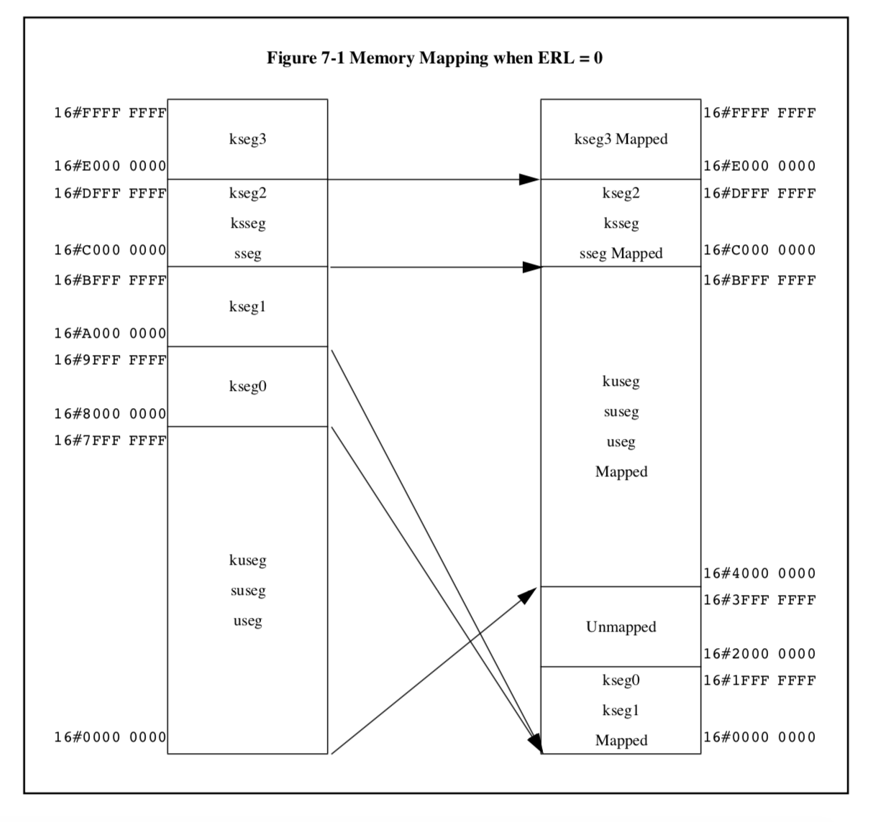

## 0CTF/TCTF 2020 flash

### reverse

I write a baby os using mips. It read you flag and check it.  
If you debug qemu at start, you can easily find the bios file located at 0xbfc00000, and it copy kernel text to 0x80000000 and jmp to kernel.  
  
However, the kernel's code is obfuscated on branch instruction. It will always be stuck in a dead loop. If you rebase the kernel text code at 0x80000000, you can also find code reference after dead loop code, and there are many gadgets that jmp to code after dead loop. With reasonable guessing, you can figure out where the pc goes after dead loop. In this way you can relocate branch destination in dead loop text and patch code. Then you will find a baby vm in kernel.   

It's a 16 bit stack machine, and only support limited operations like `+-*%` and condition branch. The vm encrypt your input using RSA with static public key, compare result with const data. The RSA public key is very small and you can easily solve p q and decrypt const data to get flag.  

### pwn  
If you can only solve the reverse challenge using `reasonable guessing`, you can never solve this pwn challenge.  The second flag is stored in flash, you need a RCE to read it.  
I use a timer interupt to control execution flow. At a specific time interval, machine received irq and jmp to 0x80000180. The kernel exception handler setup environment and change the status register to bootstrap mode, and use a `syscall` instruction to raise another exception. Because the status register is bootstrap mode now, CPU will goto 0xbfc00380. Bios will check the current exception pc, if cpu stuck in a dead loop, it will search next execution flow address in a global branch table, which stored in a RBTree, and set the pc to correct address.   

You can find more detailed MIPS CPU informations at [this link](https://s3-eu-west-1.amazonaws.com/downloads-mips/documents/MD00090-2B-MIPS32PRA-AFP-06.02.pdf)
 
There is an off by one bug when pushing data to stack in stack machine. The vm stack top is 0x80020000, and the RBTree struct pointer is stored at 0x80020000! However, you can only push a short number to stack, which means only high bit can be overwrite in RBTree pointer.  

You should know the last trick to solve this challenge. The MIPS32 virtual address space is divided into five segments: `useg`、`kseg0`、`kseg1`、`ksseg`、`kseg3`. In kernel mode, mips CPU will map memory using following method.

If you access zero address in kernel mode, it will raise a excpetion. However in bootstrap mode, 0x80000000 is mapped to zero address. You can read data stored in 0x80000000 from zero address, and no excpetion raised.  
  

In this way, you can overwrite RBTree pointer, change it from 0x800287c0 to 0x000087c0. When next timer interupt comes, bios will access rbtree node from 0x87c0. The 0x800087c0 is exactly located in your input buffer heap, so you can construct a fake node at 0x800087c0 and control PC when returning from exception handler.  

 

